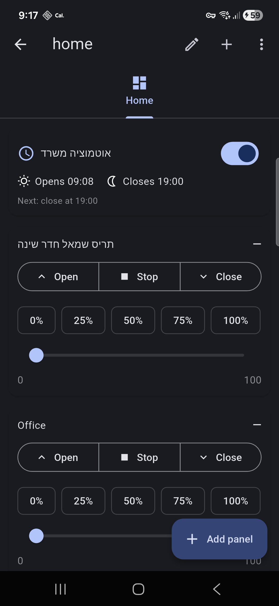
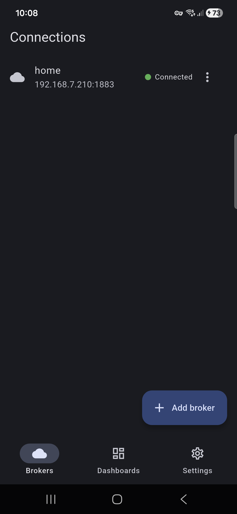
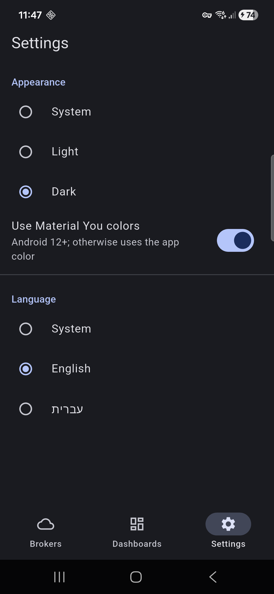
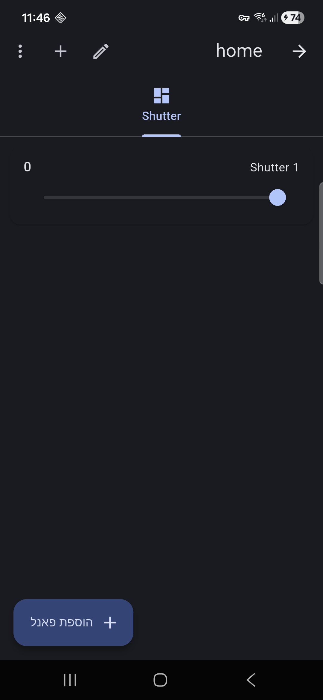

# ZigDash

**The MQTT dashboard built for Zigbee2MQTT — your smart home dashboard builds itself.**

[](LICENSE)
[](https://play.google.com/store/apps/details?id=com.giladtamam.zigdash)
[](https://flutter.dev)
[](https://github.com/sponsors/giladtamam)

ZigDash discovers your Zigbee devices automatically — no manual topic wiring —
and controls lights, shutters, switches, and sensors from your phone or a
wall-mounted tablet. No cloud, no ads, no account. Free and open source.

Runs great on lean setups (SMLIGHT SMHUB, Raspberry Pi, any MQTT broker) —
no Home Assistant required, though it works alongside it happily: it's just
MQTT.

<p align="center">
  
  
  
  
</p>

## Features

- **Zigbee2MQTT auto-discovery** — scan your Z2M bridge and create a panel for
  every device with a single tap. JSON-path extraction on every panel.
- **16 panel types** — toggle, button, slider, cover (open/stop/close with
  presets), multi-state, combo, radio, LED indicator, node status, progress,
  text input, text log, scene, schedule, auto-close rule, Z2M discovery.
- **Hub-side automation** — schedules and auto-close rules run as retained MQTT
  config executed by Node-RED on your always-on hub (SMLIGHT, Raspberry Pi, …).
  Your phone can be off; the automation still runs. Bundled Node-RED flows in
  `node-red/`.
- **Shortcuts** — Quick Settings tiles switch a light or plug in one tap, or
  open a slider for a shutter; Android's Device Controls show every dashboard
  device as a card with brightness and position sliders.
- **Any MQTT broker** — TCP, SSL/TLS, WebSocket, WSS. Broker auto-scan on the
  LAN, username/password in hardware-backed secure storage, automatic
  exponential-backoff reconnect, multiple brokers with instant switching.
- **Tailscale support** — secure remote access over your WireGuard mesh, no
  port forwarding.
- **Polished** — Material 3 with Material You dynamic color (Android 12+),
  phone and tablet in both orientations, eleven languages (English, French,
  German, Spanish, Dutch, Swedish, Norwegian, Russian, Polish, Portuguese,
  Hebrew) with full RTL, responsive panel
  grid, dashboard lock, JSON backup/restore.
- **Private** — no ads, no account. Anonymous usage data only if you opt in;
  builds without an analytics key (F-Droid, your own) send nothing at all.
  Data lives on your device and your broker.

## Install

- [Google Play](https://play.google.com/store/apps/details?id=com.giladtamam.zigdash)
- F-Droid / IzzyOnDroid / Obtainium: in progress.

## Getting help

Stuck setting up, or something doesn't work? In the app, open **Get help**
(Settings › Help & support, or the link on any setup error). It shows tips
for where you are, then lets you email support with the app's Support
details (no passwords, addresses or device names), or write to
giladtamam1@gmail.com. I usually reply within 3 days, in English or Hebrew.
I'll never ask for your passwords or for remote access.

Feature requests, bug reports, and ideas are welcome too — open a
[GitHub issue](https://github.com/giladtamam/zigdash/issues).
Built by a Zigbee2MQTT user, for the Zigbee2MQTT community.

## Sponsor

ZigDash is free, with no ads, and stays that way. If it's useful to you,
you can [sponsor it on GitHub](https://github.com/sponsors/giladtamam). A
[Google Play review](https://play.google.com/store/apps/details?id=com.giladtamam.zigdash)
helps too.

## Build & test

Requires the Flutter SDK (stable channel).

```bash
flutter pub get
dart run build_runner build --delete-conflicting-outputs
flutter analyze
flutter test
```

Release APKs (per-ABI):

```bash
flutter build apk --release --split-per-abi
```

Signing uses `android/key.properties` (gitignored). Tags (`vX.Y.Z`) drive the
CI release pipeline, which attaches signed per-ABI APKs to the release.

## Repository layout

- `lib/` — Flutter app (Riverpod, go_router, Drift, Material 3)
- `node-red/` — bundled Node-RED flows for hub-side automation
- `store/` — Play Store listing copy, screenshots, graphics
- `fastlane/` — supply metadata (F-Droid / IzzyOnDroid read this)

## License

[MIT](LICENSE) © 2026 Gilad Tamam
