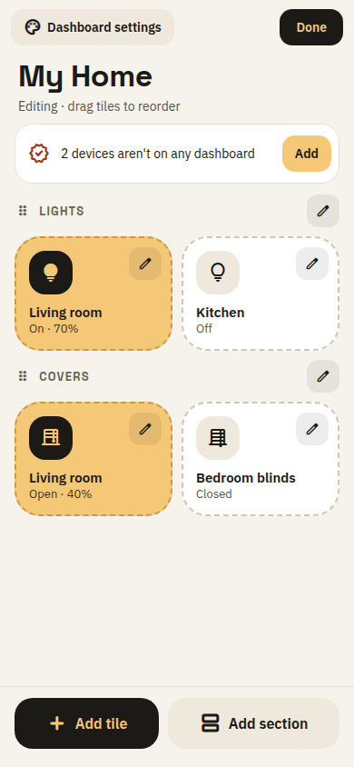
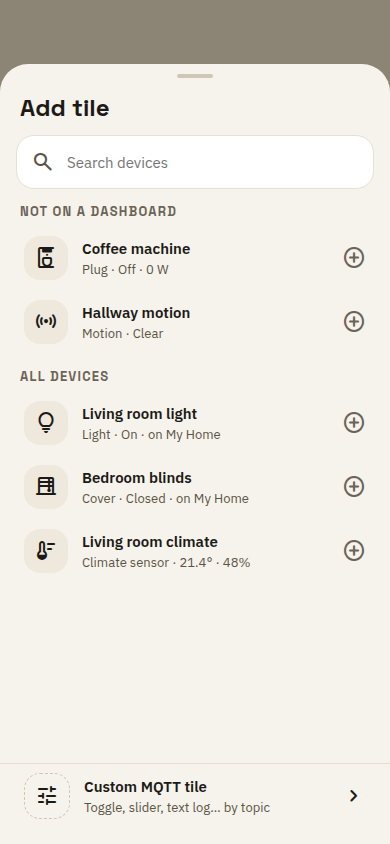
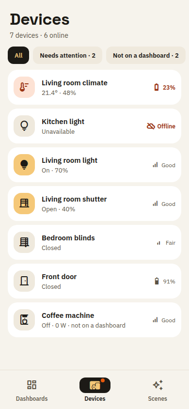
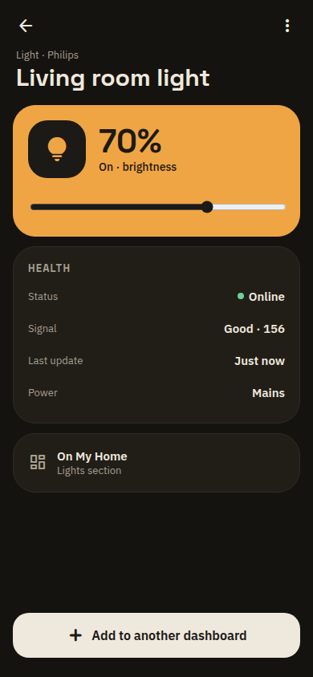
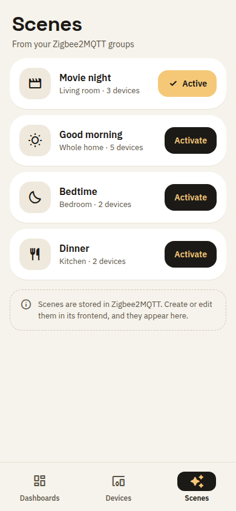
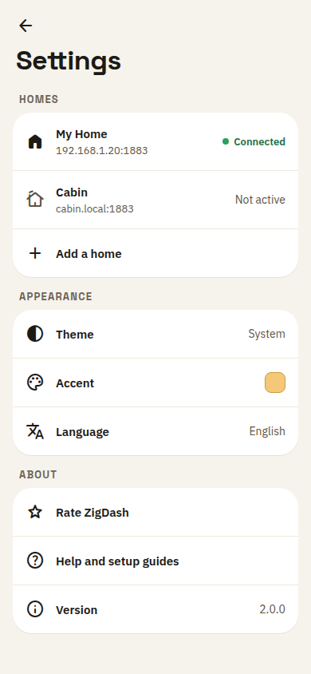
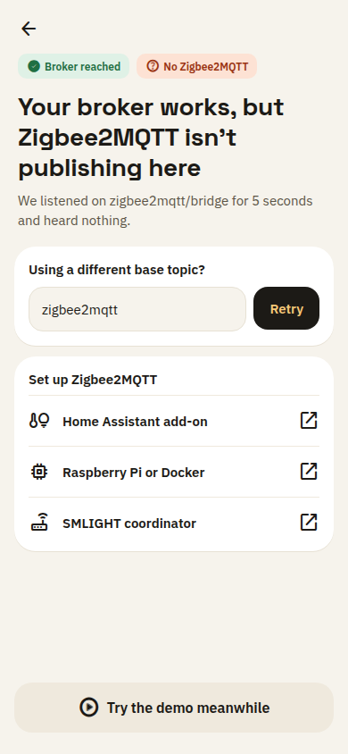
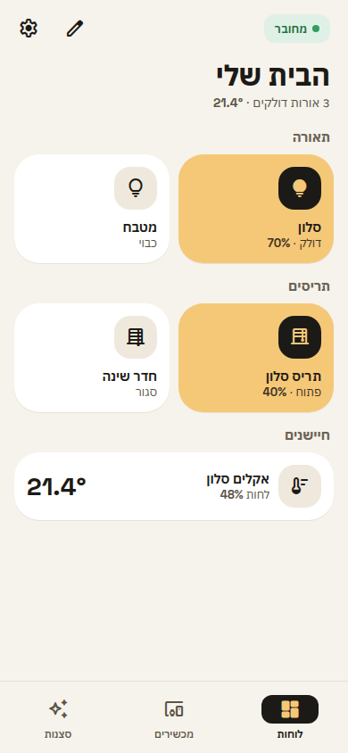
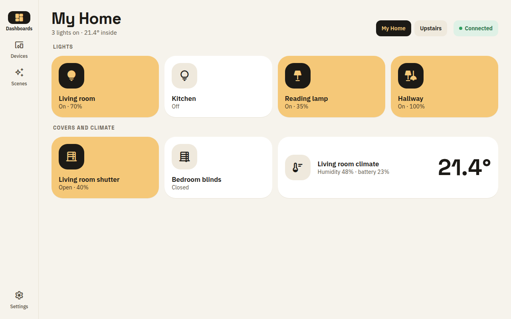

# ZigDash 2.0 screens (Signal)

Mockups of the in-scope screens in the chosen direction, Signal, using the tokens in [tokens.md](tokens.md) and the structure in [ia.md](ia.md).
The live canvas is the Claude Design artifact https://claude.ai/artifact/Gt1x8Q8TpDfY2VMVqNqF5w (private to the owner).
The images below are exports of the boards. The canvas is the source of truth when they differ.

Screens already covered by the direction round live on the same canvas: the Signal light dashboard, the dark "broker unreachable" dashboard, the welcome screen, and the Wall Panel tablet in dark.

## Dashboard, edit mode

- **What changed.** One Edit mode replaces the six toolbar icons of 1.9 (audit: toolbar overload). Tiles get a dashed outline and one edit button each. Sections get a drag handle and a rename button.
- **Unassigned devices.** A card at the top counts devices that are on no dashboard and opens the Add tile sheet filtered to them. Devices are never auto-added.
- **Bottom actions.** "Add tile" and "Add section" are the only creation paths. "Dashboard settings" holds the name, accent and column count.
- **Why.** Editing becomes a mode you enter and leave, so the everyday dashboard carries no editing chrome.

## Add tile, device-first

- **What changed.** The picker lists devices, not the 16 MQTT panel types (audit: jargon picker). "Not on a dashboard" comes first, then all devices with type and live state.
- **Custom MQTT tile.** The 16 raw behaviors sit behind one row at the bottom and open the topic-first form. That form keeps today's fields in the new styling and is not mocked separately.
- **Why.** New users think in devices. Power users keep every raw behavior one tap away.

## Devices

- **What changed.** A new tab in the bottom bar. Each row shows type icon, name, state, and one health signal: battery when low, offline, or link quality.
- **Filters.** "All", "Needs attention" and "Not on a dashboard". The tab icon carries a dot when anything needs attention.
- **Why.** It gives users a reason to open the app when nothing is broken and surfaces dying batteries before a device drops.

## Device page, dark

- **What changed.** Tapping a device opens a page with the full control, a health card and where the device appears. "Add to another dashboard" is the second route into a dashboard.
- **Dark theme.** Hairline surfaces on a warm near-black ground, with the amber active fill brightened for dark.
- **Accessibility.** The brightness slider is labeled as brightness, which fixes the "1 of 2" defect from the audit.

## Scenes

- **What changed.** Scenes are cards with one Activate button. The active scene shows in amber.
- **Scope.** Scenes are ZigDash's own: captured from device states in the app, stored on the phone, and activated by publishing every action. They can also be added to a dashboard as a tile. (An earlier version of this note said scenes come from Zigbee2MQTT; the shipped feature is the app's own scenes, confirmed while charting 1.12.) The board's footnote about Zigbee2MQTT is outdated.

## Settings, homes

- **What changed.** Brokers are presented as homes with their address and connection state. "Add a home" replaces the broker list as a primary tab.
- **Grouping.** Homes, Appearance and About. Language is one row that opens a picker, instead of eight radio buttons inline.
- **About.** "Rate ZigDash", help and setup guides, and the version. There is no telemetry or account row.

## Setup outcome: broker found, no Zigbee2MQTT

- **What changed.** When the broker answers but nothing arrives on the bridge topic, the app says exactly that instead of showing an empty dashboard.
- **Recovery.** The base topic can be edited and retried in place. Setup guides link out for Home Assistant, Raspberry Pi or Docker, and SMLIGHT.
- **Demo.** "Try the demo meanwhile" is offered only here and on the none-found outcome, per the first-run decision.

## Dashboard, Hebrew right-to-left

- **Mirroring.** The whole layout mirrors: header actions, tile order, icon position and the bottom bar.
- **Type.** Hebrew uses IBM Plex Sans Hebrew. Section labels are not uppercased or letter-spaced, since Hebrew has no case.
- **Numbers.** Values such as 70% and 21.4° are isolated left-to-right runs so they never reorder.

## Tablet dashboard, light

- **What changed.** A navigation rail replaces the bottom bar, the grid has four columns, and quick actions are 64 px.
- **Header.** Dashboard switching uses chips when there are two or more dashboards. Connection state sits at the end of the header.
- **Wide tiles.** Reading tiles can span two columns, so a temperature can be read from across the room.
- **Theme.** Dark is the tablet default from the direction round. This board shows the light variant with the same layout.

## Not mocked here

- **Custom MQTT tile form.** It keeps the current fields, reordered topic-first, and needs no new layout decision.
- **Thermostat and color-light tiles.** They are deferred on the map and need their own control design.
- **Kiosk presentation.** It stays on the map as fog, after phasing.
